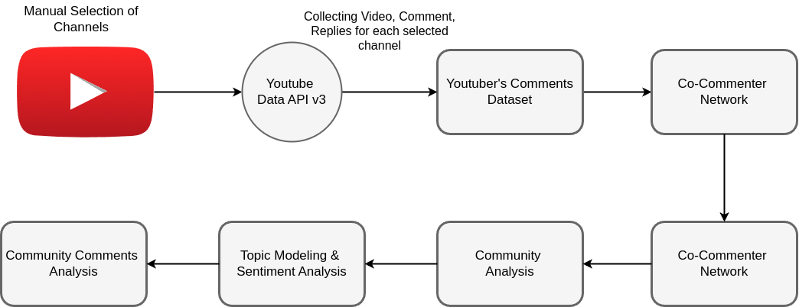

# Identifying and Analyzing Communities in YouTube Comment Sections 

Thiago Amado Costa

## Summary
 

- This code was used for the paper [Identifying and Analyzing Communities in YouTube Comment Sections](./main.pdf)
- Divided into crawler/ to build datasets of youtube comments, 
- graphs/ to build co-commenter networks, calculate graph metrics and plots 
- notebooks/ 
    - comunidade.ipynb: text preprocessing, topic modeling with [BERTopic](https://maartengr.github.io/BERTopic/index.html), 
    sentiment analysis with a multilingual [XLM-roBERTa-base model](https://huggingface.co/cardiffnlp/twitter-xlm-roberta-base-sentiment)
    - pca.ipynb: Principal Component Analysis and Hierarchical Clustering 
    - analysis.ipynb: analysis of the sentiment analysis model's results, plotting word cloud

## Paper's Abstract

YouTube is the largest video streaming platform on the web, attracting billions of users daily 
who watch and engage with content through comments. A significant portion of these users consist 
of children and teenagers, who frequently interact with one another in the comment sections, forming 
active communities. However, these communities can also experience negative interactions between users,
including instances of online bullying. To explore these communities, we used the YouTube Data API 
v3 to collect comments from videos produced by creators targeting this demographic. We used these
comments to construct co-commenter networks. We then applied topic modeling and sentiment analysis 
to gain deeper insights into the content and dynamics within these communities. This study identified 
distinct community patterns. Smaller communities demonstrated stronger internal connections, while 
larger networks showed weaker ties. The analysis uncovered two significant findings: one community showing 
coordinated negative behavior, and another revealing signs of targeted youth advertising practices.

